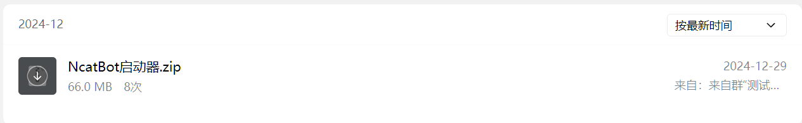

# NapCat配置

1. 你需要在QQ群:[💬 NcatBot/ฅ^•ﻌ•^ฅ🎉](https://qm.qq.com/q/7qSl3x5V60)里面获取专属启动器

<figure><figcaption></figcaption></figure>

2. 打开启动器，进行配置

<figure><figcaption></figcaption></figure>

3. 进行第一次QQ登入，登入后会载入

<figure><figcaption></figcaption></figure>

4. 点击后会打开配置界面，因为目前ncatbot只支持正向ws和http，所以启动器只提供对应的配置，注：服务名称是保存的唯一标识，无法修改，配置好之后点击保存即可.png>)
5. 开启监听

<figure><figcaption></figcaption></figure>
